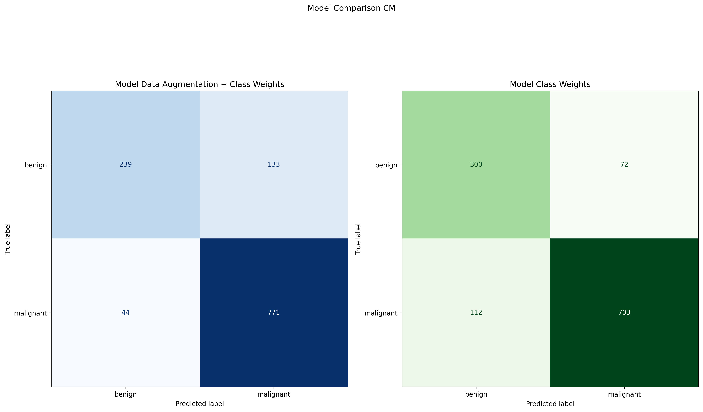
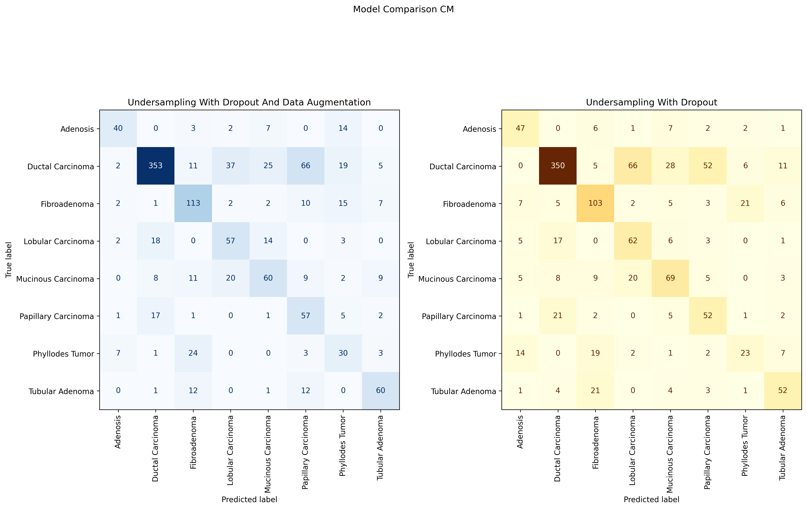

# Breast Cancer Image Classification

## Overview 

This project was developed in two stages using the BreakHis dataset, which contains ~7,900 histopathological breast tumor images at multiple magnifications (40x, 100x, 200x, 400x).

1. Binary Classification: Build a deep learning model to distinguish between benign and malignant tumors.

2. Multiclass Classification: Extend the model to identify the specific tumor subtype (8 total classes).

The main goal is to develop models that can assist in the accurate diagnosis of breast tissue images, supporting early detection and classification of breast cancer through computer vision.

## Summary of Insights

### Binary

In this stage, the goal was to build a CNN model capable of distinguishing between benign and malignant breast tumor images.
Since this is a medical context, the most critical metric is recall, as we aim to minimize false negatives, i.e. cases where a malignant tumor is incorrectly classified as benign. Accuracy remains important but secondary to recall.

To address class imbalance (malignant samples represented `~68%` of the dataset), several techniques were tested, including class weighting and data augmentation to improve model generalization. Two models were trained using these approaches and their Confusion Matrices are displayed below:

Both models achieved similar overall accuracy `(~85%)`, but their performance differed slightly across metrics:

- The Class Weights only model achieved higher precision and AUC, making it more conservative and stable.  

- The Data Augmentation + Class Weights model achieved a much higher recall `(~0.95)`, correctly identifying more malignant cases at the cost of slightly lower precision.

In healthcare applications, this trade-off favors the latter model, as prioritizing recall helps minimize the risk of false negative diagnoses.

### Multi Class

This stage was more complex, as it involved classifying eight tumor subtypes. The dataset was also highly imbalanced, with `Ductal Carcinoma` representing about `44%` of all images.

To address this, multiple architectures and techniques were tested, including class weights, dropout, regularization, and transfer learning (using VGG). However, none of the models performed well during training or validation, primarily due to the data imbalance.

The key improvement came from applying undersampling to the Ductal Carcinoma class, reducing its size to match that of the second-largest class, Fibroadenoma. Before this adjustment, the model tended to overfit features from Ductal Carcinoma, leading to biased predictions. After undersampling, performance improved significantly in both training and validation.

The best-performing models were trained on the undersampled dataset, one with and one without data augmentation. Both shared a strong CNN architecture with four convolutional layers (increasing filters per layer), batch normalization, and two dropout layers to reduce overfitting and improve generalization.

Both models achieved similar overall performance, but the version using data augmentation again produced slightly better results. Because this is a multiclass task, macro-averaged metrics are the most relevant, as they treat all classes equally.

The final model achieved approximately:

Accuracy: `~65%`

Macro-averaged Recall: `0.62`

Macro-averaged AUC: `0.93`

An important takeaway from the confusion matrices is that, when the model misclassified an image, it rarely confused malignant and benign categories. Instead, it typically misclassified within the same broader group (e.g., one malignant type predicted as another malignant type). This suggests that the model successfully learned distinct visual features that differentiate benign from malignant tumors.

# Next Steps & Recommendations

- Further Class Balancing: Apply oversampling or targeted data augmentation to the remaining minority classes to reduce imbalance beyond Ductal Carcinoma. This would allow the model to learn representative features across all tumor types  
- Enhanced Transfer Learning: Explore deeper transfer learning approaches using architectures like ResNet, or EfficientNet. The initial VGG experiment was limited due to computational constraints, but could yield significant performance gains with fine-tuning.  
- Hyperparameter Optimization: Integrate Keras Tuner to systematically search for optimal hyperparameters (e.g., learning rate, dropout, filter size) rather than relying on manual tuning.

Overall, this project demonstrates how deep learning can support early cancer diagnosis and highlights the critical role of data balance, recall optimization, and model interpretability in healthcare AI applications.